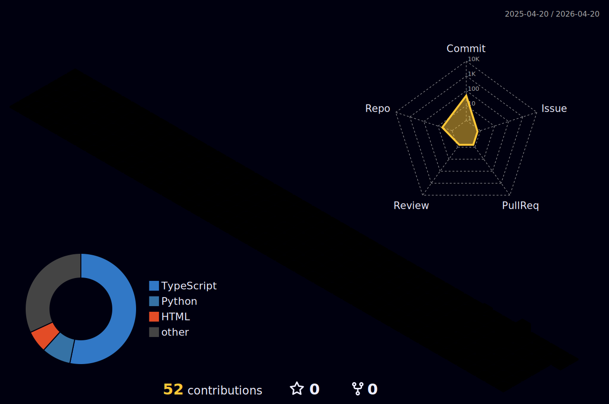

<h1 align="center">👋 Arnav Parmaj</h1>

  <i>Cybersecurity • AI/ML • Systems • Building by breaking</i>

---

# 🚀 About Me

- 🧠 3rd year Engineering student  
- 🛠️ Exploring Cybersecurity and AI/ML through hands-on building  
- 📱 Occasionally experimenting with iOS development  
- ⚡ I learn by breaking things, understanding why they fail, and rebuilding them better  

---

# 🌐 Socials:
 
 
 

---

# 💻 Tech Stack:
 
 
 
 
 
 
 
 
 
  
 
 
 
  
 
 
 
 
 
 
 
 
 
  
 

---

# 🔥 3D Contributions

---

# 📊 GitHub Stats:
 
 

---

# 🏆 GitHub Trophies

---

